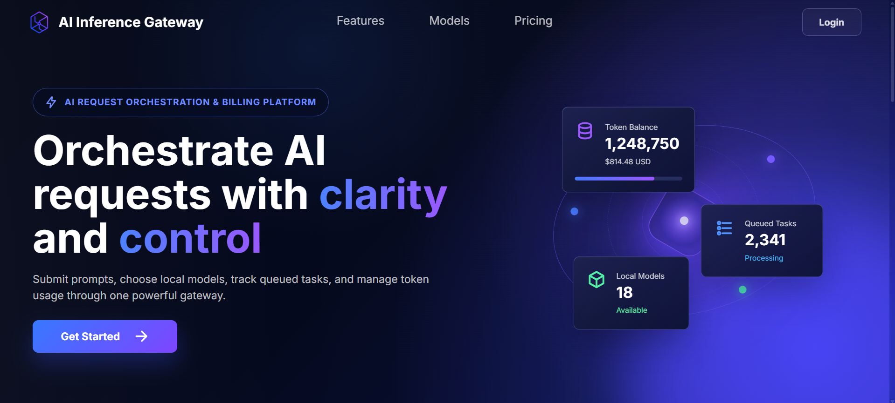
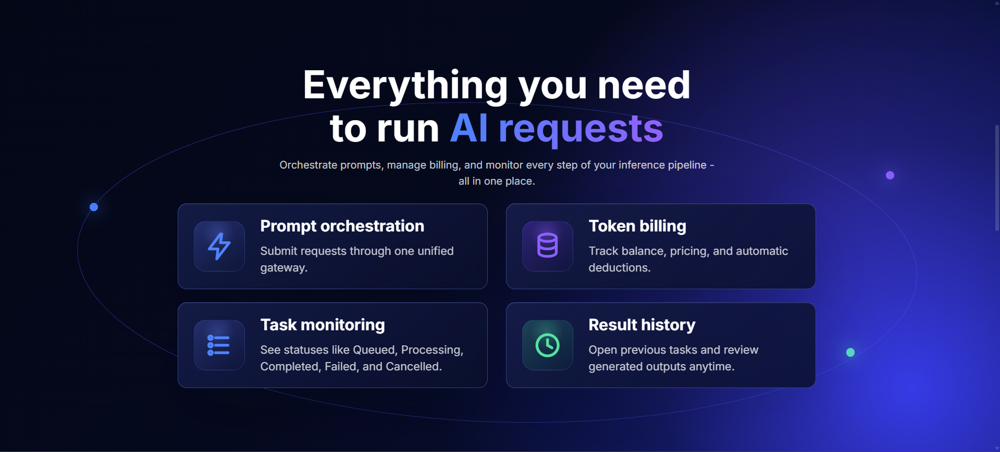
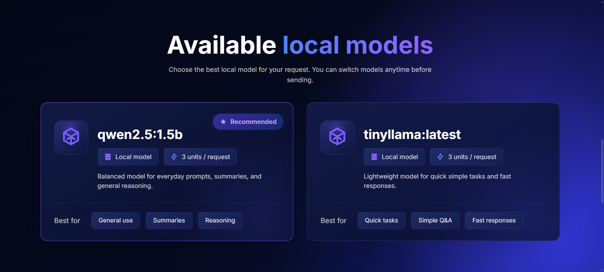
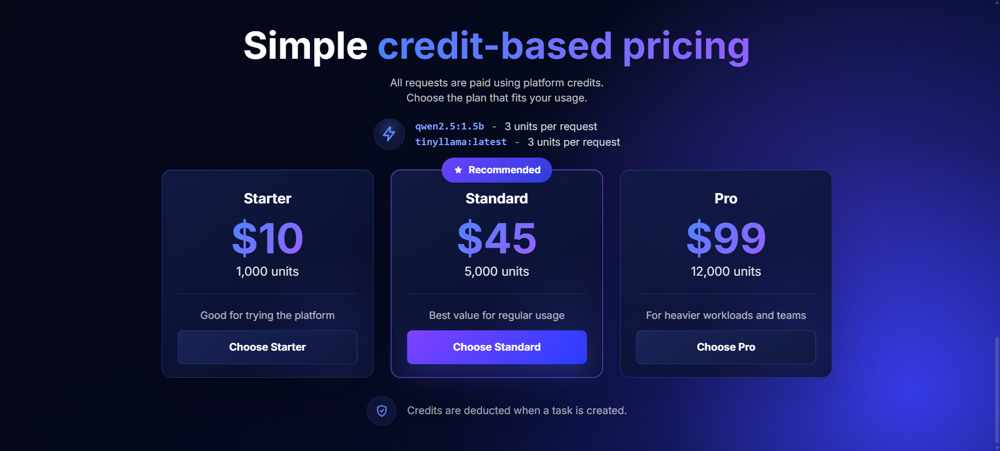
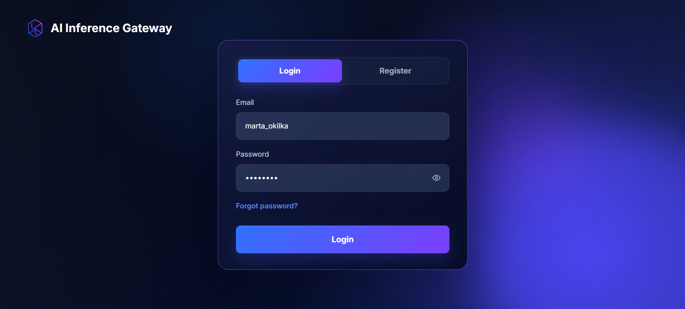
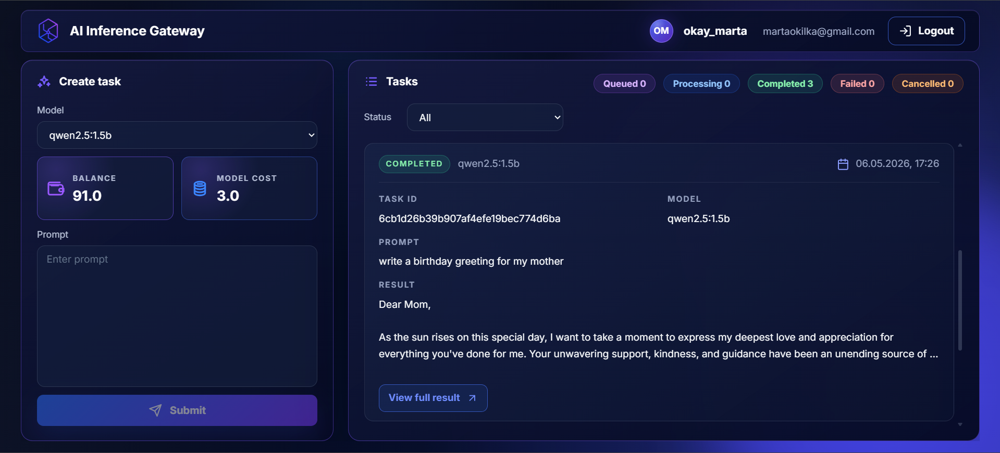

# AI Inference Gateway

AI Inference Gateway is a full-stack web app for submitting prompts to local AI models through a controlled gateway. It includes token billing, background task processing, task history, and a React dashboard for managing paid AI model requests.

## Key Features

- Landing page
- User registration and login
- JWT authentication
- Password reset by email
- Token balance tracking
- AI model selection
- Prompt task creation
- Background task processing
- Task statuses: `Queued`, `Processing`, `Completed`, `Failed`, `Cancelled`
- Task cancellation with refund
- Transaction history in the billing database
- Gateway-based API access

## Technologies


## Screenshots

### Landing Page



### Landing Page (Features)



### Landing Page (Models)



### Landing Page (Pricing)



### Authentication



### Dashboard



## Architecture Overview

| Component         |    Port | Responsibility                                      |
| ----------------- | ------: | --------------------------------------------------- |
| `frontend`        |  `5173` | React UI                                            |
| `gateway-service` |  `8080` | Public API, JWT validation, request forwarding      |
| `billing-service` |  `8081` | Auth, users, balances, transactions, password reset |
| `task-service`    |  `8082` | Models, tasks, workers, Ollama integration          |
| PostgreSQL        |  `5432` | `billing_db` and `task_db`                          |
| Ollama            | `11434` | Local AI model runtime                              |

```text
Frontend -> Gateway -> Billing / Task -> PostgreSQL / Ollama
```

## Repository Structure

```text
frontend/
  React + Vite frontend application

services/
  gateway-service/
  billing-service/
  task-service/

backend/
  Earlier monolith/reference implementation
```

The current active application is in `frontend/` and `services/`. The `backend/` directory is kept as an earlier reference implementation.

## Environment Setup

Each service has its own example environment file:

- `services/gateway-service/.env.example`
- `services/billing-service/.env.example`
- `services/task-service/.env.example`

Copy each `.env.example` to `.env` and fill in local values for your machine. Do not commit real `.env` files or secrets.

## Database Setup

Create two PostgreSQL databases:

```sql
CREATE DATABASE billing_db;
CREATE DATABASE task_db;
```

Apply migrations from:

- `services/billing-service/migrations/`
- `services/task-service/migrations/`

## Running Locally

Start PostgreSQL and Ollama first. Ollama should be running on `http://localhost:11434`, and at least one model should be installed.

Run the services in separate terminals:

```bash
cd services/billing-service
go run main.go
```

```bash
cd services/task-service
go run main.go
```

```bash
cd services/gateway-service
go run main.go
```

Run the frontend:

```bash
cd frontend
npm install
npm run dev
```

Open the app at:

```text
http://localhost:5173
```

## Running with Docker Compose

```bash
docker compose up --build
```

Services:

- Frontend: http://localhost:5173
- Gateway: http://localhost:8080
- Billing Service: http://localhost:8081
- Task Service: http://localhost:8082
- PostgreSQL: localhost:5432
- Redis: localhost:6379

## Redis caching

The task-service caches `GET /api/models` responses in Redis using the key `ai_models:all`.
The first request loads data from PostgreSQL and stores it in Redis.
The next requests are served from Redis until TTL expires or cache is invalidated after model synchronization.

## Testing and Build

```bash
cd services/billing-service
go test ./...
```

```bash
cd services/task-service
go test ./...
```

```bash
cd services/gateway-service
go test ./...
```

```bash
cd frontend
npm run build
```

## API Overview

Main gateway endpoints:

- `POST /api/auth/register`
- `POST /api/auth/login`
- `POST /api/auth/forgot-password`
- `POST /api/auth/reset-password`
- `GET /api/auth/me`
- `GET /api/models`
- `POST /api/tasks`
- `GET /api/tasks`
- `DELETE /api/tasks/{id}`

The frontend should call the gateway on port `8080`; internal services are not intended to be called directly by the browser.
